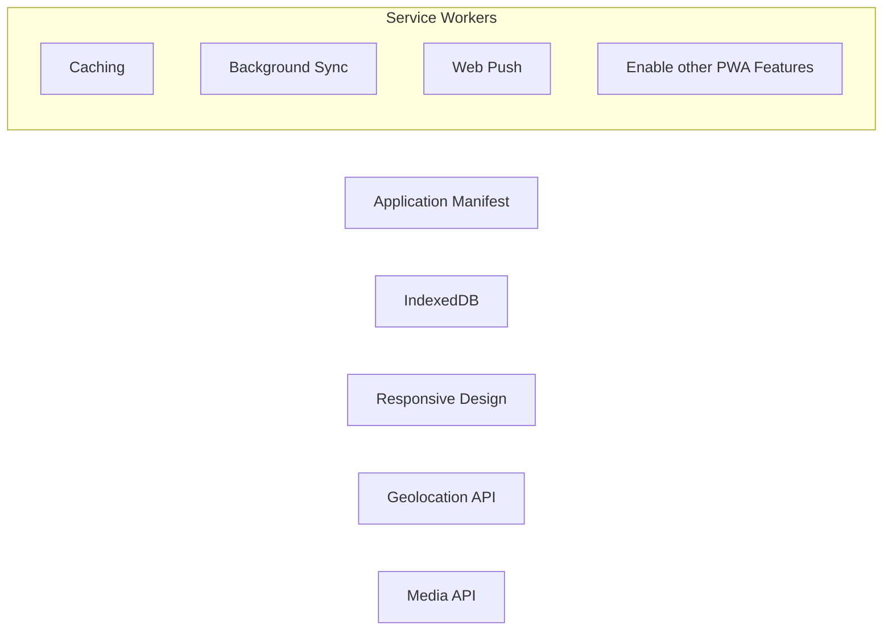

# PWA (Progressive Web Applications) についてのノート
PWAについての調査ノートです。  
MDNに親切丁寧に記載されているのですが、あえて自身の為に記載しているものです。
PWA実装の実践を行うために、調べたことを記載してます。

## Index

|項目|説明|
|---|---|
|[About PWA](./about-pwa.md)  |PWAについてにのメモです。ネイティブアプリ、既存のWebアプリとの（特に構成や通信方法などを図によって）比較します。|
|[PWAとしての機能](./function-as-pwa.md)|Pどのような機能を備えているWebアプリがPWAと言えるのか？を記載|
|[Manifest](./manifest.md)|PWAがネイティブアプリのようにインストール可能にするため、ウェブアプリマニュフェストを作成し必要な設定を記載します。|
|[Service Worker API](./service-worker-api.md)|PWAの中核的な技術で、主にオフライン対応やバックグラウンド処理を行うよう実装します。|
|[Cache Interface](./cache-interface.md)|ネットワークリクエストのレスポンスを保存・取得するための仕組みです。Service Workerと連携して、リクエストのレスポンスをカスタマイズし、オフライン対応を行います。|
|[Background Synchronization API](./background-synchronization-api.md)|ネットワーク接続が不安定または切断されている状況で、データの同期を保証するための機能を提供します|
|[Background Fetch API](./background-fetch-api.md)|ウェブアプリケーションがバックグラウンドで大容量のリソース（例えば動画や大量のデータ）をダウンロードする機能を提供するAPIです|
|[Web Periodic Background Synchronization API](./web-periodic-background-synchronization-api.md)|PWAが一定間隔でバックグラウンドでデータを同期できる機能を提供する API です。ユーザーがアプリを開く前に最新のコンテンツを準備することができます。|
|[Push API](./push-api.md)|PWAがサーバーからプッシュ通知を受け取るための機能を提供します。プッシュ通知を実装するためには、Push APIとNotifications APIの両方を使用します。|
|Notifications API||
|IndexDb||
|Native Device Features||
|Service Worker Management||
|SPA と PWA||

## PWAの中核を成す機能

以下は、PWAを構成する中核となる機能です。  
Service Workerの役割が非常に重要になっていることがわかります。

- Caching: オフラインのサポート
- Background Sync: バックグランドでユーザデータを同期する。
- Web Push: モバイルのようなプッシュ通知
- Application Manifest: ホーム画面への追加を可能にする。
- Responsive Design: どのデバイスにも対応した見た目を保つ。
- IndexedDB: 動的なコンテンツのキャッシュを保存しておく。
- Geolocation API: ユーザ位置情報にアクセスします。
- Media API: デバイスのカメラとマイクにアクセスします。

## 補足
- [WebWorker](./webworker.md)

## 参考サイト
- [MDN: プログレッシブウェブアプリ (PWA)](https://developer.mozilla.org/ja/docs/Web/Progressive_web_apps)
- [プログレッシブ Web アプリ (PWA) の概要](https://learn.microsoft.com/ja-jp/microsoft-edge/progressive-web-apps-chromium/)
- [プログレッシブ ウェブアプリ](https://web.dev/explore/progressive-web-apps?hl=ja)
- [Progressive Web Apps (PWA) - The Complete Guide](https://www.udemy.com/course/progressive-web-app-pwa-the-complete-guide/?couponCode=KEEPLEARNING)

## TypeScriptで、PWAを利用する
- Service Worker

