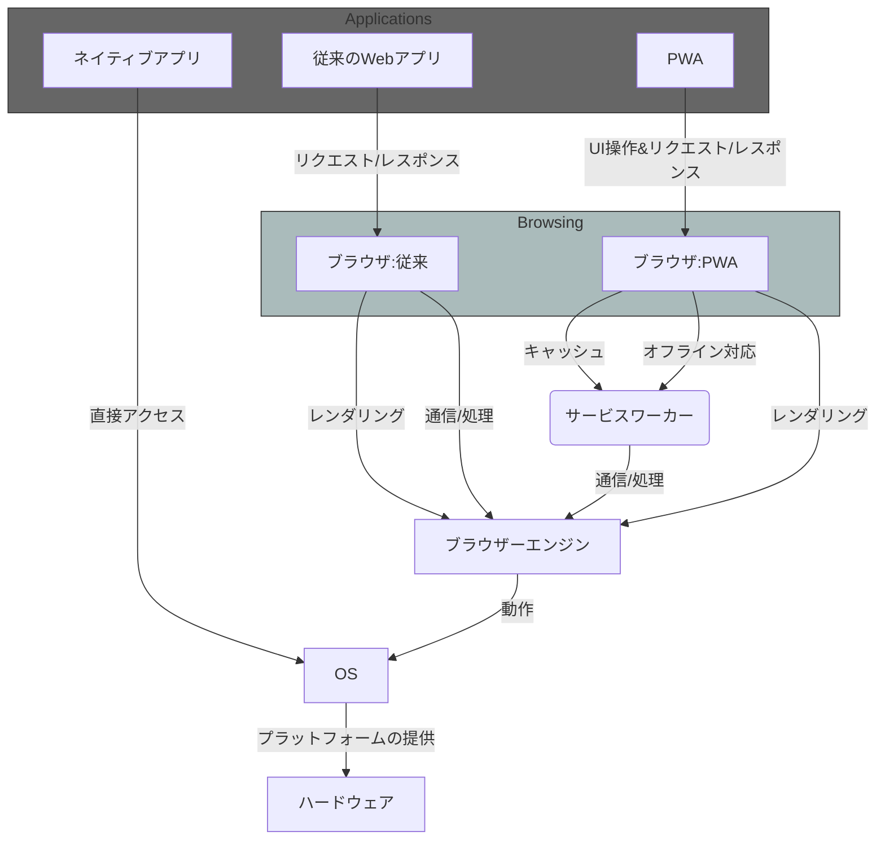
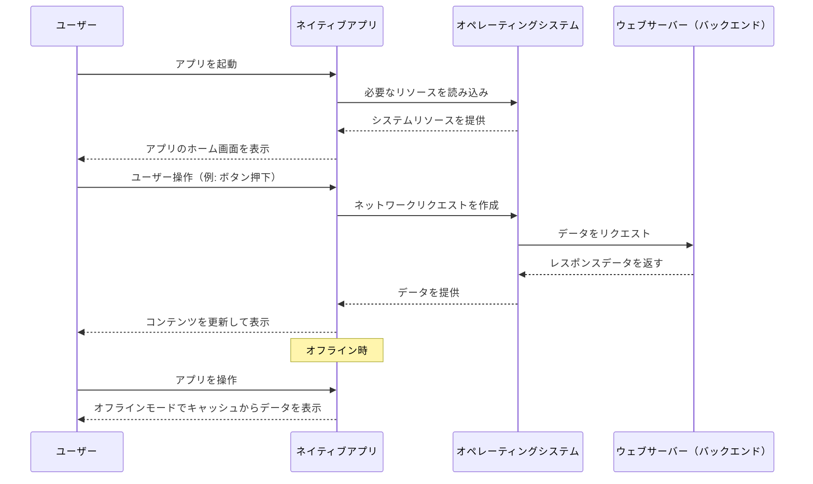
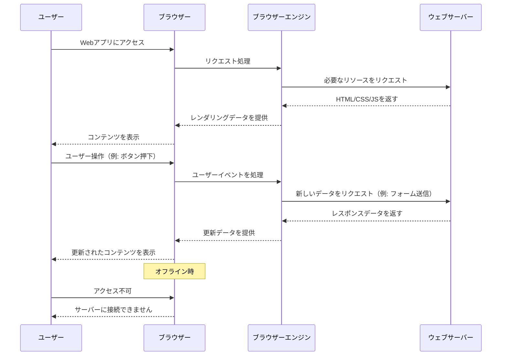
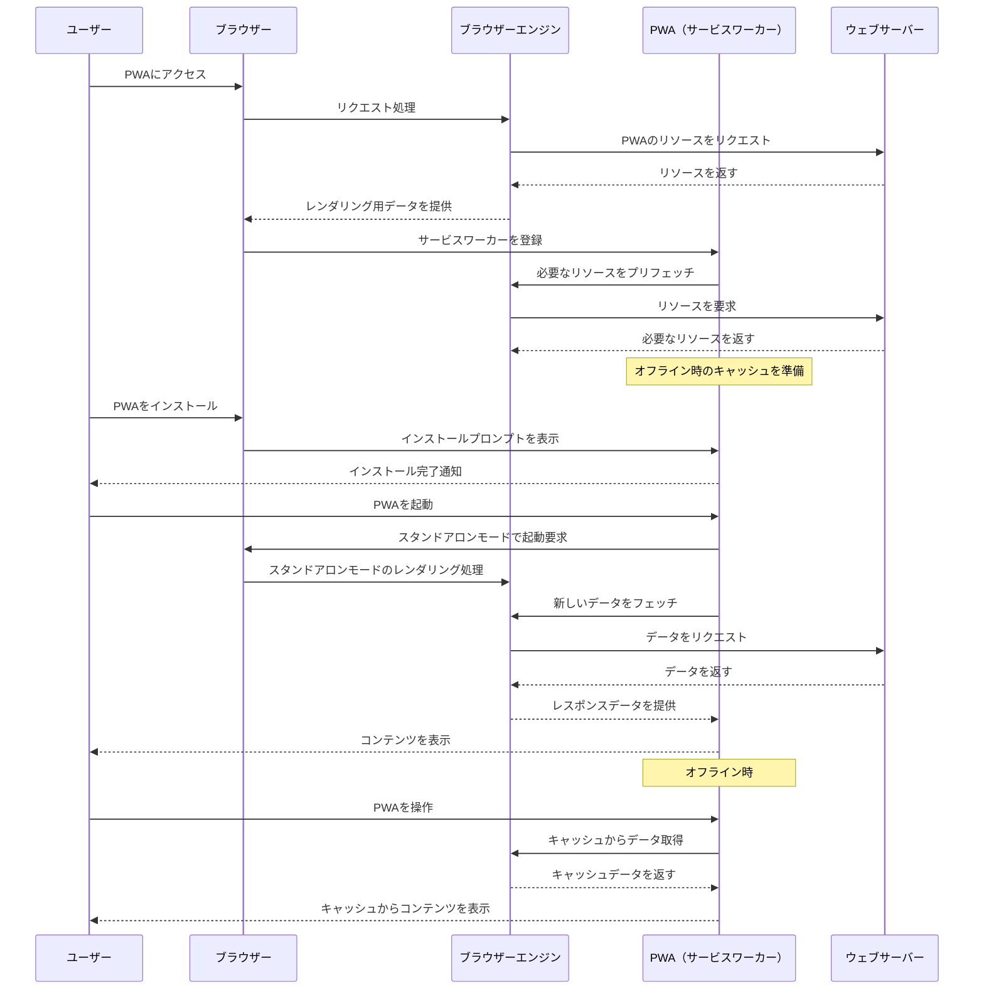

# PWA (Progressive Web Applications) とは

プログレッシブウェブアプリ（Progressive Web Apps）とは

プログレッシブウェブアプリケーション (PWA) は、ウェブプラットフォーム技術を利用して構築されたアプリですが、プラットフォーム専用のアプリのような使い勝手を提供します。

- 端末にインストールすることができる
- スタンドアロンアプリとして起動できる
- バックブラウンドやオフラインで動作できる
   - 端末がネットワークに接続していない状態での動作
   - バックグラウンドでのコンテンツ更新
   - サーバーからのプッシュメッセージへの応答
   - OSの通知システムを使用した通知表示 
- ブラウザーUIで実行するのではなく、全画面を使用することができる
- 端末に統合し、共有対象やソースとして登録し、端末の機能にアクセスすることができまる
- ウェブを通じて開くためだけではなく、アプリストアで配布することもできる

## PWAの利点
- 標準ウェブプラットフォーム技術を使用して開発されているため、単一のコードベースからさまざまな種類の端末やオペレーティングシステムで動作させることができる
- ウェブから直接アクセスすることができる

## PWAと従来のWebアプリ、ネイティブアプリの比較

|特性|PWA (Progressive Web Apps)|ネイティブアプリ (Native Apps)|従来のWeb Apps|
|---|---|---|---|
|インストール|インストール不要、ユーザーのデバイスに直接アクセス可能|アプリストアからダウンロードしてインストールが必要|インストール不要、ブラウザ経由でアクセス|
|パフォーマンス|高速でスムーズな操作が可能だが、ネイティブアプリに比べると多少遅いこともある |最高のパフォーマンスと最適化が可能|比較的遅く、パフォーマンスはブラウザ依存|
|デバイス機能のアクセス|限定的だが、カメラ、GPS、センサーなどの主要な機能にアクセス可能|ほぼ全てのデバイス機能にアクセス可能|限られたアクセス、主にインターネット関連の機能に限定|
|オフライン機能|キャッシュやサービスワーカーを用いたオフライン動作が可能|完全にオフラインで動作可能|通常はオフラインでは機能しない|
|更新|ユーザーがブラウザを更新することなく、サーバー側での更新が即座に反映される|アプリストア経由でのアップデートが必要|ブラウザをリフレッシュするだけで最新の内容にアクセス可能|
|開発コスト|一つのアプリをすべてのプラットフォームで利用可能にするため、コストが抑えられる|各プラットフォーム用に個別のアプリが必要で、開発とメンテナンスのコストが高くなる可能性がある|コストはPWAと似ているが、プラットフォームごとの最適化が少ない|
|ユーザー体験|ネイティブアプリに近いスムーズな体験を提供できる|最も優れたユーザー体験が可能|一貫性が欠けることがあるが、適切に設計されれば良好な体験が提供できる|

## PWAとブラウザとの関係

1. ネイティブアプリ  
OS上で直接動作し、ブラウザやブラウザーエンジンを介さずに実行される。
2. 従来のWebアプリ  
ブラウザを介して動作し、ブラウザーエンジンがアプリケーションのHTML/CSS/JavaScriptをレンダリングする。
3. PWA
   - 従来のWebアプリのようにブラウザを介するが、サービスワーカーを使用してオフライン対応やキャッシュ機能を実現する。
   - ネイティブアプリに近いエクスペリエンスを提供しつつ、ブラウザーエンジンとOSの上で動作する。

### ネイティブアプリ・Webアプリ・PWAの動作モデル比較

## PWAの構成
PWA は常に高水準のアーキテクチャを 2 つに分けて持っています。

- メインアプリ  
HTML、CSS と、アプリの UI を実装する JavaScript の一部（例えばユーザーイベントの処理）
- オフラインとバックグラウンドのタスクを処理するサービスワーカー

## PWAの通信な流れ
以下それぞれの通信の流れの比較として、動作シーケンス図を記載します。
- [ネイティブアプリ](#ネイティブアプリの動作シーケンス)
- [従来のWebアプリ](#従来の Web Appの動作シーケンス)
- [PWA](#Progressive Web Appの動作シーケンス)

### ネイティブアプリの動作シーケンス
1. 直接OSと通信
   - ネイティブアプリはOSを通じてシステムリソースやネットワークにアクセスする
   - ブラウザやブラウザエンジンの層を介さない
2. オフライン対応  
PWAと同様に、キャッシュやローカルストレージを使用してオフライン時でも基本的な動作が可能
3. 高い自由度  
ネイティブアプリはデバイスのセンサーやファイルシステム、ハードウェア機能に直接アクセスできるため、複雑な動作やパフォーマンス最適化が可能

### 従来の Web Appの動作シーケンス

1. 従来のWebアプリはブラウザエンジンを介してサーバーからリソースを取得する
   - ユーザーの操作ごとにサーバーとの通信が発生する
   - HTML/CSS/JavaScriptを毎回リクエストし、レンダリングしてコンテンツを表示する
2. オフライン対応が基本的にない  
サーバーに接続できない場合、ユーザーにエラーメッセージを表示
3. シンプルな構成  
サービスワーカーやキャッシュなどの仕組みがなく、ブラウザエンジンを通じたサーバーとの通信が動作の基本

### Progressive Web Appの動作シーケンス

1. ブラウザとブラウザエンジンを介して動作
   - PWAは従来のWebアプリと同様にブラウザを介して動作しますが、サービスワーカーを利用してキャッシュ管理やリクエスト処理を高度化しています
   - ブラウザエンジンがリソースの取得とレンダリングを担当します
2. サービスワーカーの役割
   - サービスワーカーはPWAの中核で、オフラインキャッシュやバックグラウンドデータ同期を実現します
   - 初回アクセス時にサービスワーカーが登録され、以降は必要なリソースをプリフェッチしてオフライン時でも動作可能な状態を整えます
3. インストール可能
   - PWAは、ネイティブアプリに近い体験を提供するため、ブラウザがインストールプロンプトを表示します
   - インストール後はスタンドアロンモードで起動し、ネイティブアプリのようにデバイスに統合された形で利用できます
4. オンライン/オフライン両対応
   - オンラインではサーバーと通信して最新データを取得
   - オフライン時にはキャッシュされたデータを利用してコンテンツを表示します
   - サービスワーカーを利用したキャッシュ管理により、従来のWebアプリにはない柔軟性を持ちます
5. 動作基盤  
PWAは、ブラウザエンジンの制御下で動作します。ネイティブアプリのようにOSレベルで直接動作するわけではありませんが、ブラウザがサポートするWeb APIを利用することで、高度な機能を実現します。

#### 比較のポイント

|比較対象|共通点|相違点
|---|---|---|
|ネイティブアプリ|<ul><li>インストール可能でスタンドアロンモードで起動できる</li><li>オフラインで動作可能</li></ul>|<ul><li>ネイティブアプリはOSを直接操作できるが、PWAはブラウザエンジンを介して間接的に操作</li><li>PWAはWeb技術（HTML/CSS/JavaScript）で構築され、クロスプラットフォーム対応が容易</li></ul>|
|従来のWebアプリ|ブラウザを介して動作し、サーバーと通信してデータを取得|<ul><li>PWAはサービスワーカーによるキャッシュ管理があり、オフライン動作が可能</li><li>PWAはインストール可能でスタンドアロンモードを提供するため、従来のWebアプリよりネイティブアプリに近いユーザー体験を提供</li></ul>|

