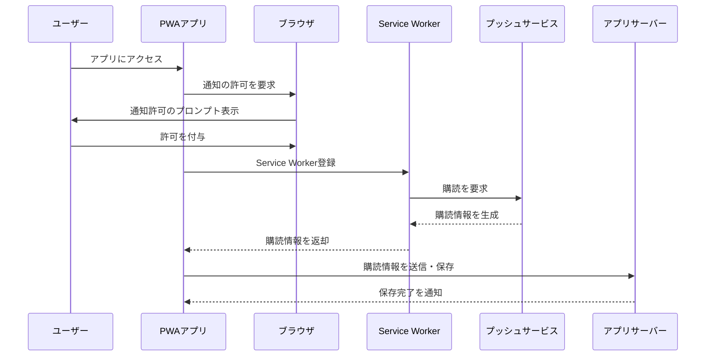
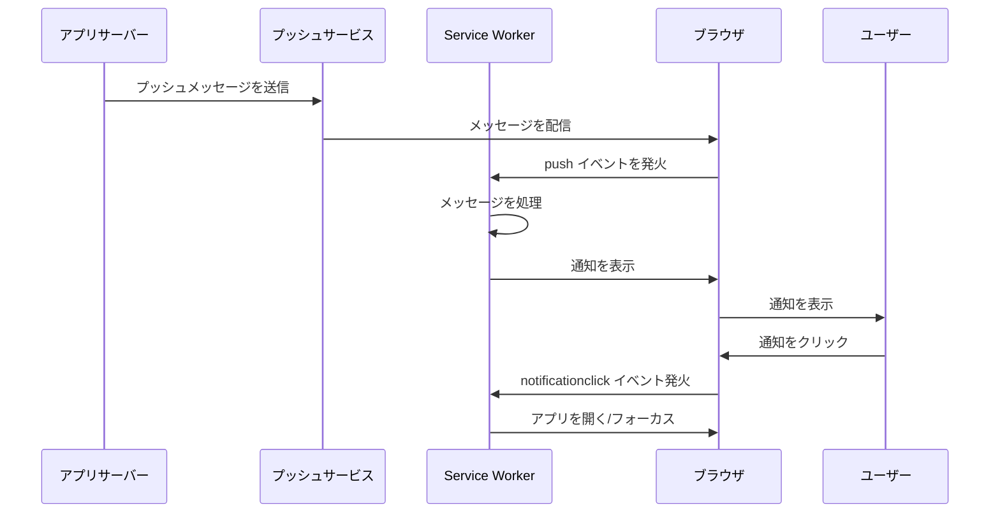

# PWAとしての機能
どのような機能を備えているWebアプリがPWAと言えるのか？

PWAと言えるアプリは以下の機能を提供している。
- [インストール可能にする](#インストール可能にする)
- [オフライン操作](#オフライン操作)
- [バックグラウンド処理](#バックグラウンド処理)
   - [バックグラウンド同期](#バックグラウンド同期)
   - [バックグラウンドフェッチ](#バックグラウンドフェッチ)
   - [定期バックグラウンド同期](@定期バックグラウンド同期)
   - [プッシュ通知](#プッシュ通知)
- [権限と制限](#権限と制限)

## インストール可能にする
PWA としての機能の一つとして、「プラットフォーム専用のアプリのように端末にインストールできること」があります。
PWA を端末にインストール可能にするためには、以下の要件を満たす必要があります。

PWA のインストールは、ユーザーの端末にアプリケーションを統合し、ネイティブアプリに近い体験を提供するための重要なステップです。これにより、ユーザーはアプリをより頻繁に利用しやすくなり、リテンション率の向上が期待されます。

### 1. HTTPS環境で提供

PWA がインストール可能であるためには、アプリが HTTPS プロトコルを使用して提供される必要があります。これにより、安全な接続が保証されます。

> [!NOTE]
> ローカル開発の場合  
> localhost または 127.0.0.1 を利用した環境でもテストが可能です。

### 2. Manifest ファイルの設定

manifest.json ファイルは、PWA がインストール可能であるために必要な基本情報をブラウザに提供します。このファイルには、アプリ名、アイコン、スタートURL、テーマカラーなどが定義されている必要があります。

#### 必須のプロパティ
- name または short_name（アプリ名）
- icons（192px および 512px のアイコン）
- start_url（アプリのエントリーポイント）
- display（standalone または fullscreen 推奨）

詳しい設定方法については [Web App Manifest](./manifest.md) をご参照ください。

### 3. Service Worker の導入

PWA がインストール可能であるためには、Service Worker を利用してキャッシュ管理やオフライン機能を実装する必要があります。これにより、ブラウザがアプリを「インストール可能」と認識します。

#### 基本的な要件
- アクティブな Service Worker が登録されていること
- キャッシュやフェッチイベントでのネットワーク管理が適切に実装されていること

### 4. ブラウザのインストール要件

ブラウザは、以下の条件を満たしている場合に PWA のインストールプロンプトを表示します。

#### Chromeの場合
- HTTPS 環境で提供されている。
- Manifest ファイルが正しく設定されている。
- Service Worker が登録され、少なくとも1つのリソースをキャッシュしている。

> [!CAUTION]
> Apple の Safari では、PWA のインストール体験が他のブラウザと異なり、ホーム画面に追加するための専用プロンプトはありません。

### PWAのインストール体験

インストール可能な PWA は、ブラウザが以下のような方法でユーザーに通知します

1. インストールプロンプト  
対応ブラウザでは、インストール可能な条件が満たされると「ホーム画面に追加」などのプロンプトが表示されます。
2. メニューバーからの追加  
一部のブラウザでは、メニューから「アプリをインストール」を選択することができます。
3. アプリストアでの公開  
Google Play や Microsoft Store など、主要プラットフォームのアプリストアで公開し、インストール可能にすることもできます。アプリストアでの公開には追加の要件があるため、それぞれのプラットフォームのガイドラインを確認してください。

- [Google Play ストアでの公開ガイドライン](https://chromeos.dev/en/publish/pwa-in-play)
- [Microsoft ストアでの公開ガイドライン](https://learn.microsoft.com/en-us/microsoft-edge/progressive-web-apps-chromium/how-to/microsoft-store)


## オフライン操作

PWAの大きな特徴の一つは、ネットワーク接続がない場合でもアプリを操作できる点です。これにより、ユーザーはオフライン時でも必要な機能を利用し続けることができます。この仕組みは、主に Service Worker を用いて実現されます。

オフライン操作を実現することで、PWAはユーザー体験を大幅に向上させることができます。この仕組みを構築する際には、キャッシュ戦略の選択とリソース管理が成功の鍵となります。


### オフライン操作の基本原理

1. Service Worker の導入  
サービスワーカーは、ブラウザとネットワーク間のリクエストを仲介し、必要に応じてキャッシュされたリソースを提供します。
2. Cache API の活用  
サービスワーカーがインストール時やフェッチイベント時にキャッシュを制御することで、オフライン時にもアプリの主要なリソース（HTML、CSS、JavaScript、画像など）を提供できます。  
キャッシュインターフェースの実装について詳しくは、[Cache Interface](./cache-interface.md) をご参照ください。

3. フェッチイベントの制御  
サービスワーカーは fetch イベントをインターセプトし、ネットワークが利用可能な場合はリクエストを通し、利用不可の場合はキャッシュからレスポンスを提供します。


### 1. 基本的なキャッシュ設定

サービスワーカーがインストールされた際に、静的リソースをキャッシュします。  

キャッシュインターフェースの実装について詳しくは、[Cache Interface](./cache-interface.md) をご参照ください。


#### Service Worker
```js
self.addEventListener('install', (event) => {
  event.waitUntil(
    caches.open('pwa-cache-v1').then((cache) => {
      return cache.addAll([
        '/',
        '/index.html',
        '/styles.css',
        '/app.js',
        '/icon.png',
      ]);
    })
  );
});
```

### 2. フェッチイベントの制御

リソースへのリクエストをインターセプトし、キャッシュを優先的に利用します。

#### Service Worker
```js
self.addEventListener('fetch', (event) => {
  event.respondWith(
    caches.match(event.request).then((cachedResponse) => {
      // キャッシュがあれば返し、なければネットワークから取得
      return cachedResponse || fetch(event.request);
    })
  );
});
```

### 3. オフライン時のフォールバックページ

オフライン時に指定したフォールバックページを返す例。

#### Service Worker
```js
self.addEventListener('fetch', (event) => {
  event.respondWith(
    caches.match(event.request).then((response) => {
      return (
        response ||
        fetch(event.request).catch(() => caches.match('/offline.html'))
      );
    })
  );
});
```

### オフライン状態の検知と対応
オフラインの状態によって、キャッシュ戦略を切り分ける方法もありだと思います。

```js
// 現在の接続状態を確認
console.log(navigator.onLine ? "オンライン" : "オフライン");

// メインスクリプトでのオフライン検知
window.addEventListener('online', () => {
  console.log('ネットワーク接続が回復しました');
  // オンライン時の処理
});

window.addEventListener('offline', () => {
  console.log('ネットワーク接続が切断されました');
  // オフライン時の処理
});
```

### オフライン対応での注意点
1. キャッシュの管理  
   - 古いキャッシュの削除や更新戦略を明確に設計します。
   - キャッシュ名にバージョン番号を含めると、簡単に管理できます。
2. リソースサイズの最適化  
   - キャッシュするリソースが大きすぎると、ストレージの制限に達する可能性があります。
3. フォールバックページの準備
   - オフライン時にユーザーに適切な情報を提供するフォールバックページを設計することで、使いやすさを向上させます。
4. 動的データの扱い
   - 動的なコンテンツ（APIレスポンスなど）をキャッシュする場合、適切な有効期限や更新タイミングを設ける必要があります。

### 具体的なユースケース
- ニュースアプリ  
最新の記事をオンライン時にキャッシュし、オフライン時にも閲覧可能にします。
- タスク管理アプリ  
ユーザーがオフラインでタスクを追加・編集し、オンラインに戻った際に同期します。
- Eコマースアプリ  
商品リストやカテゴリ情報を事前にキャッシュし、オフラインでも閲覧できるようにします。

## バックグラウンド処理
PWAのバックグラウンド処理は、アプリがフォアグラウンドにいない状態でも特定のタスクを実行可能にする機能です。この仕組みにより、ユーザーがアプリを閉じたり、デバイスをスリープ状態にしていても、データの同期やファイルのダウンロード、通知の送信などを行うことができます。

### 主な機能
- ネットワーク接続の回復をトリガーとしたデータ同期
- バックグラウンドでの大規模なデータダウンロード
- ユーザーへのリアルタイム通知

PWAにおけるバックグラウンド処理の実装には、Service Worker と以下のAPIが使用されます。
- [Background Synchronization API](./background-synchronization-api.md)
- [Background Fetch API](./background-fetch-api.md)
- [Web Periodic Background Synchronization API](./web-periodic-background-synchronization-api.md)
- [Push API]./push-api.md)

これらのAPIを活用することで、ユーザー体験を向上させ、オフライン環境や非アクティブ状態でも機能を提供できます。


## バックグラウンド同期
ネットワーク接続が回復した時に未送信のデータを同期します。ネットワーク接続が回復した際にアプリがデータ同期を実行できる仕組みです。ユーザーがオフライン時に行った操作をオンラインに戻ったときに自動的に同期します。

バックグラウンド同期の実装について詳しくは、[Background Synchronization API](./background-synchronization-api.md) をご参照ください。

### 実現できること
- メッセージアプリで、オフライン時に送信されたメッセージをバックグラウンドで送信
- フォームの入力内容を一時保存し、ネットワーク回復後に送信
- タスク管理アプリで、追加されたタスクを自動的にクラウドと同期

### 主な特徴
- ネットワーク接続回復をトリガー  
Service Worker がバックグラウンドで同期イベントを検知して処理を実行
- ユーザー操作不要  
ユーザーがアプリを再度開かなくても自動的にデータ同期が行われる

### 同期イベントの登録
サービスワーカーにタスクの実行を依頼するには、メインアプリは `navigator.serviceWorker.ready` にアクセスし、`ServiceWorkerRegistration` オブジェクトで解決します。アプリは次に、次のように `ServiceWorkerRegistration` オブジェクトの `sync.register()` を呼び出します。

#### 例) `send-message`というタスクを登録します。
このアプリはタスクの名前 "send-message" を渡しています。
```js
// main.js

async function registerSync() {
  const swRegistration = await navigator.serviceWorker.ready;
  swRegistration.sync.register("send-message");
}
```
- [`ServiceWorkerRegistration.sync`](https://developer.mozilla.org/ja/docs/Web/API/ServiceWorkerRegistration/sync):  
デバイスがネットワークに接続されたときに実行するタスクを登録するための SyncManager インターフェイスへの参照を返します。

### 同期イベントの処理
端末がネットワーク接続を保有するとすぐに、ブラウザーは必要に応じてサービスワーカーを再起動し、サービスワーカーのスコープで `sync` という名前のイベントを発生します。サービスワーカーはタスク`send-message`の名前を調べ適切な関数、この場合は `sendMessage()` を実行します。

```js
// service-worker.js
self.addEventListener("sync", (event) => {
  if (event.tag == "send-message") {
    event.waitUntil(sendMessage());
  }
});
```
- [sync イベント](https://developer.mozilla.org/ja/docs/Web/API/ServiceWorkerGlobalScope/sync_event):  
sync イベントが発生した際常に実行されるイベントハンドラーです。これは、ネットワークが利用可能になるとすぐに発生します。

`sendMessage()` 関数の結果をイベントの `waitUntil()` メソッドに渡しています。`waitUntil()` メソッドは `Promise`を引数に取り、プロミスが決定するまでサービスワーカーの停止をしないようブラウザーに要求します。 これにより、ブラウザーが処理が成功したかどうかを知ることができます。プロミスが拒否された場合、ブラウザーは `sync` イベントを再度発行して再試行します。

だだし、`waitUntil()` メソッドはブラウザーがサービスワーカーを停止させないことを保証するものではありません。処理に時間がかかりすぎる場合、サービスワーカーはいずれにせよ停止されます。この場合、処理は中止され次の`sync` イベントが発生したときにハンドラーが実行されます。

Chrome の場合、サービスワーカーは次のような場合に閉じられたと考えられます。

- 30 秒のアイドル状態が続いた場合
- 同期 JavaScript を `30 秒`間実行している場合
- `waitUntil()` に渡されたプロミスが決定するまで 5 分以上かかっている場合

## バックグラウンドフェッチ

バックグラウンドフェッチは、長時間にわたる大規模なデータ（例: 動画ファイルやアプリの更新データなど）のダウンロードをバックグラウンドで効率的に処理するための仕組みです。

バックグラウンドフェッチでは、次のようになります。

- リクエストはメインアプリの UI から開始されます。
- メインアプリが開いているかどうかに関わらず、ブラウザーは進行中のリクエストをユーザーに通知し、キャンセルされる可能性や進行状況を調べることを可能にする持続的な UI 要素を表示します。
- リクエストが成功または失敗で完全に発行されるか、ユーザーがリクエストの進行状況を調べるよう依頼されると、ブラウザーはサービスワーカーを（必要であれば）開始し、サービスワーカーのスコープで適切なイベントを発行します。

バックグラウンドフェッチの実装について詳しくは、[Background Fetch API](./background-fetch-api.md) をご参照ください。

### 実現できること
- 動画ストリーミングアプリでのオフライン視聴用動画のダウンロード
- ファイル管理アプリでの大規模ファイルの一括ダウンロード
- ソフトウェアのアップデートをバックグラウンドで実行

### 主な特徴
- 中断や失敗を防ぐ  
ネットワーク切断時でも、接続回復後にダウンロードが再開可能。
- 進行状況の通知  
ダウンロード状況をユーザーに通知する仕組みを提供。

### バックグラウンドフェッチリクエストの実行
バックグラウンドフェッチリクエストは、メインアプリのコードで次のように `backgroundFetch.fetch()` を `ServiceWorkerRegistration `オブジェクトで呼び出すことで開始されます。
```js
// main.js

async function requestBackgroundFetch(movieData) {
  const swRegistration = await navigator.serviceWorker.ready;
  const fetchRegistration = await swRegistration.backgroundFetch.fetch(
    "download-movie",
    ["/my-movie-part-1.webm", "/my-movie-part-2.webm"],
    {
      icons: movieIcons,
      title: "Downloading my movie",
      downloadTotal: 60 * 1024 * 1024,
    },
  );
  //...
}
```
### リクエスト結果の処理
フェッチが成功または失敗で完了するか、ユーザーが進行状況UIをクリックすると、ブラウザーは必要に応じてアプリのサービスワーカーを開始し、サービスワーカーのスコープで以下のイベントを発生させます。

- backgroundfetchsuccess: すべてのリクエストが成功した場合
- backgroundfetchfail: 1 つ以上のリクエストが失敗した場合
- backgroundfetchabort: フェッチがユーザーまたはメインアプリによって中止された場合
- backgroundfetchclick: ブラウザーが表示している進行状況の UI 要素をユーザーがクリックした場合

レスポンスデータにアクセスするには、ハンドラーは次のようにします。
```js
// service-worker.js

self.addEventListener("backgroundfetchsuccess", (event) => {
  const registration = event.registration;

  event.waitUntil(async () => {
    const registration = event.registration;
    const records = await registration.matchAll();
    const responsePromises = records.map(
      async (record) => await record.responseReady,
    );

    const responses = Promise.all(responsePromises);
    // レスポンスで何かを行う
  });
});
```

### ブラウザーの UI の更新
`ackgroundfetchsuccess` と `backgroundfetchfail` に渡されるイベントオブジェクトには `updateUI()` メソッドがあり、ブラウザーが表示する UI を更新してユーザーに読み取り処理を通知するために使用することができます。`updateUI()` を使うと、ハンドラーは UI要素のタイトルとアイコンを更新することができます。

```js
// service-worker.js

self.addEventListener("backgroundfetchsuccess", (event) => {
  // レスポンスデータの取得と格納
  // ...

  event.updateUI({ title: "ダウンロードが完了しました。" });
});

self.addEventListener("backgroundfetchfail", (event) => {
  event.updateUI({ title: "ダウンロードが完了できませんでした。" });
});

```

### ユーザー操作への応答
`backgroundfetchclick` イベントは、フェッチ中にユーザーがブラウザーが表示させる UI 要素をクリックしたときに発行されます。

ここで期待されるレスポンスは、フェッチ処理に関する詳細情報をユーザーに与えるウィンドウを開くためのもので、サービスワーカーから `clients.openWindow()` を使用して実行することができます。例えば、次のようになります

```js
// service-worker.js

self.addEventListener("backgroundfetchclick", (event) => {
  const registration = event.registration;

  if (registration.result === "success") {
    clients.openWindow("/play-movie");
  } else {
    clients.openWindow("/movie-download-progress");
  }
});
```

## 定期バックグラウンド同期
PWA はメインアプリが閉じられている間、バックグラウンドで定期的にデータを更新することができます。定期バックグラウンド同期は、一定間隔でバックグラウンドタスクをスケジュール実行できる仕組みです。これにより、ユーザーがアプリを開いていない状態でもデータの更新を定期的に実行できます。

### 実現できること
- ニュースアプリで最新の記事を定期的にダウンロード
- 天気予報アプリで定期的に最新の気象情報を取得
- カレンダーアプリで1日ごとの新しい予定を自動同期

### 主な特徴
- スケジュールベースの同期  
タスク実行のタイミングを定期的に設定可能。
- オンライン時に自動実行  
ネットワーク接続時のみタスクが実行され、オフライン時には待機状態。

定期バックグラウンド同期の実装について詳しくは、Web Periodic Background Synchronization API をご参照ください。

### 定期同期イベントの登録
定期的な同期イベントを登録するコードは、同期イベントの登録と同じパターンに従います。`ServiceWorkerRegistration` には `periodicSync` プロパティがあり、定期同期の名前を引数に取る `register()` メソッドがあります。

ただし、`periodicSync.register()` は追加の引数として `minInterval` プロパティを持つオブジェクトを取ります。これは同期を試みる最小間隔をミリ秒で表します。

#### main.js
```js
async function registerPeriodicSync() {
  const swRegistration = await navigator.serviceWorker.ready;
  swRegistration.periodicSync.register("update-news", {
    // try to update every 24 hours
    minInterval: 24 * 60 * 60 * 1000,
  });
}
```

### 定期同期イベントの処理
PWA は `register()` 呼び出しで具体的な間隔を要求しますが、定期的な同期イベントを生成する頻度はブラウザー次第です。ユーザーが頻繁に開いて操作するためのアプリは、ユーザーがほとんど対話しないアプリよりも定期的な同期イベントを受信する可能性が高く、受信頻度も高くなります。

ブラウザーが定期同期イベントを生成することを決定した場合、パターンは次のようになります: 必要に応じてサービスワーカーを開始し、サービスワーカーのグローバルスコープで `periodicSync` イベントを発行します。

サービスワーカーのイベントハンドラーはイベントの名前を調べ、イベントの `waitUntil()` メソッド内の適切な関数を呼び出します。

#### ServiceWorker
```js
self.addEventListener("periodicsync", (event) => {
  if (event.tag === "update-news") {
    event.waitUntil(updateNews());
  }
});
```

### 定期同期の登録解除
PWA が定期的なバックグラウンド更新を必要としなくなった場合（例えば、ユーザーがアプリの設定で定期同期をオフにした場合など）、PWA は `periodicSync` の `unregister()` メソッドを呼び出して、定期同期イベントの生成を停止するようブラウザーに依頼する必要があります。

#### main.js
```js
async function registerPeriodicSync() {
  const swRegistration = await navigator.serviceWorker.ready;
  swRegistration.periodicSync.unregister("update-news");
}
```

## プッシュ通知
プッシュ通知は、サーバーからクライアントにリアルタイムで通知を送信する仕組みです。この機能により、ユーザーはアプリが開かれていない状態でも重要な更新を受け取ることができます。

### 実現できること
- メッセージアプリで新しいメッセージを通知
- Eコマースアプリでセール情報や在庫更新を通知
- SNSでの新しいコメントやフォローを通知

### 主な特徴
- サーバーからのリアルタイム通知  
アクティブなネットワーク接続があれば即時に通知を受信可能。
- バックグラウンドでの処理  
オフライン時でも通知を保存し、ネットワーク回復後に表示。

プッシュ通知の実装について詳しくは、Push API と Notifications API をご参照ください。

### プッシュメッセージの購読
ユーザーが通知を許可すると、アプリはサービスワーカーを登録し、プッシュサービスにサブスクリプションを要求します。プッシュサービスから返されたサブスクリプション情報をアプリがサーバーに保存します。プッシュメッセージを購読するパターンは次のようになります。



1. ユーザーがアプリにアクセス
2. ブラウザに通知の許可を要求
3. ユーザーが通知を許可
4. Service Workerの登録
5. プッシュサービスへの購読要求
6. 購読情報の生成と返却
7. サーバーへの購読情報の保存

### プッシュメッセージの送信、配信、処理
サーバー上でアプリに処理させたいイベントが発生すると、サーバーはメッセージを送ることができ、その一連の流れは次のようになります。



1. サーバーからプッシュサービスへのメッセージ送信
2. プッシュサービスからブラウザへの配信
3. Service Workerでのメッセージ処理
4. 通知の表示
5. ユーザーのクリックに対する処理
6. アプリの起動またはフォーカス


## 権限と制限
バックグラウンド処理や通知機能を利用するには、ユーザーからの許可とセキュリティ要件を満たす必要があります。これにより、不正な使用を防ぎ、安全なユーザー体験を保証します。

### 主な権限と制限
1. HTTPSが必須  
すべてのバックグラウンドAPIは、セキュアなHTTPSプロトコル環境でのみ動作します。
2. ユーザーの許可が必要  
プッシュ通知やバックグラウンド同期には、ユーザーから明示的な許可を得る必要があります。
3. ブラウザの対応状況  
一部のAPI（例: 定期バックグラウンド同期）は、まだすべてのブラウザで対応しているわけではありません。

### ユーザの許可

- バックグラウンド同期 API はユーザーからの明示的な許可を必要としませんが、バックグラウンド同期リクエストの発行は主要アプリが開いている間のみ行うことができ、ブラウザーはバックグラウンド同期処理の再試行回数と時間を制限します。
- バックグラウンドフェッチ API はユーザーからの "background-fetch" の許可を要求され、ブラウザーはフェッチ処理の進行状況を表示し、ユーザーはその処理を取り消すことが可能です。
- 定期バックグラウンド同期 API はユーザーからの "periodic-background-sync" の許可を要求されます。ブラウザーはユーザーが定期バックグラウンド同期を完全に無効にできるようにする必要があります。また、ブラウザーは同期イベントの頻度を、ユーザーがアプリと対話することを選ぶ程度に関連付けることができます。そのため、ユーザーがほとんど使用しないアプリは、イベントをほとんど受け取らない（あるいはまったく受け取らない）かもしれません。
- 通知 API はユーザーからの "push" の許可をを要求され、すべてのブラウザーはプッシュイベントがユーザー可視であること、つまりユーザー可視通知を生成することを要求します。

### 実現できること
- ユーザーに通知を送る権限をリクエストし、PWAに関する信頼を確立。
- HTTPS環境で動作することで、セキュリティリスクを軽減。
