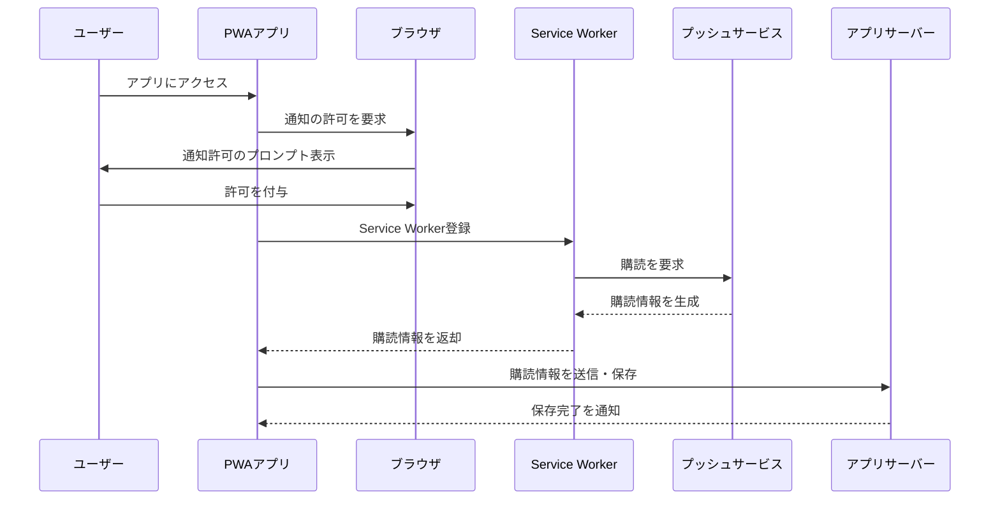
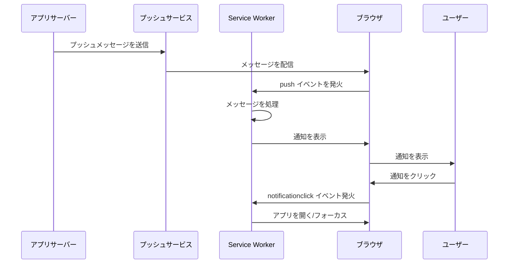

# Push API

Push API は、ウェブアプリケーションがプッシュ通知を受信するための機能を提供する API です。これにより、ユーザーがアプリを開いていない場合でも通知を受け取ることができます。Push API は Service Worker と連携して動作し、バックグラウンドでプッシュメッセージを受信・処理します。

## 特徴
1. リアルタイム通信  
サーバーからクライアントにプッシュメッセージをリアルタイムで送信可能
2. バックグラウンド動作  
アプリが開いていない場合でも、Service Worker がメッセージを受信して処理します。
3. 通知の表示  
受信したメッセージを通知として表示することで、ユーザーとのエンゲージメントを強化

## ユースケース
- 新着メッセージや通知（例: チャットアプリ）
- 更新情報の配信（例: ニュースアプリ）
- 限定セールやキャンペーンの通知（例: Eコマースアプリ）
- 状態変化の通知（例: IoTデバイスやバックグラウンド処理の完了通知）

## 基本的な動作の流れ
1. 通知の許可リクエスト  
ユーザーがプッシュ通知を受信する許可を与える必要があります。
2. Service Worker の登録  
プッシュ通知を受信するために Service Worker を登録します。
3. サブスクリプションの作成  
アプリがプッシュ通知のサブスクリプションを作成し、サーバーに保存します。
4. プッシュメッセージの送信  
サーバーが Push API を通じてプッシュメッセージを送信します。
5. プッシュメッセージの受信と処理  
Service Worker がバックグラウンドでメッセージを受信し、通知を表示します。


### プッシュ通知の購読プロセス



### プッシュメッセージの送信から表示まで


## 実装例

### 1. 通知の許可リクエスト

```js
if ("Notification" in window && "serviceWorker" in navigator) {
  Notification.requestPermission().then((permission) => {
    if (permission === "granted") {
      console.log("通知が許可されました");
    } else {
      console.log("通知が拒否されました");
    }
  });
}
```

### 2. Service Worker の登録

```js
navigator.serviceWorker.register('/sw.js').then((registration) => {
  console.log('Service Worker registered with scope:', registration.scope);
});
```

### 3. サブスクリプションの作成

```js
navigator.serviceWorker.ready.then((registration) => {
  return registration.pushManager.subscribe({
    userVisibleOnly: true, // ユーザーが視覚的に認識できる通知
    applicationServerKey: "<YOUR_PUBLIC_VAPID_KEY>", // VAPID鍵
  });
}).then((subscription) => {
  console.log("サブスクリプションが作成されました:", subscription);
  // サブスクリプション情報をサーバーに保存
  return fetch('/save-subscription', {
    method: 'POST',
    body: JSON.stringify(subscription),
    headers: { 'Content-Type': 'application/json' },
  });
});
```

### 4. プッシュメッセージの送信（サーバー側）

サーバーが Push Service を通じてメッセージを送信します。以下は Node.js の例です。

```js
const webPush = require('web-push');

// VAPID鍵
webPush.setVapidDetails(
  'mailto:example@example.com',
  '<YOUR_PUBLIC_VAPID_KEY>',
  '<YOUR_PRIVATE_VAPID_KEY>'
);

// サブスクリプション情報
const subscription = /* サブスクリプション情報 */;
const payload = JSON.stringify({ title: "新着通知", body: "新しいメッセージがあります。" });

webPush.sendNotification(subscription, payload).catch((error) => {
  console.error('プッシュ通知の送信に失敗:', error);
});
```

### 5. プッシュメッセージの受信と通知の表示
```js
self.addEventListener('push', (event) => {
  console.log('プッシュメッセージを受信しました:', event);

  const data = event.data.json();
  const options = {
    body: data.body,
    icon: '/icon.png',
    badge: '/badge.png',
  };

  event.waitUntil(
    self.registration.showNotification(data.title, options)
  );
});
```

## 実装例

### 通知の購読
#### main.js
```js
async function subscribePushNotification() {
  try {
    // Service Workerの準備
    const registration = await navigator.serviceWorker.ready;
    
    // 通知の許可を要求
    const permission = await Notification.requestPermission();
    if (permission !== 'granted') {
      throw new Error('通知が許可されていません');
    }

    // プッシュの購読
    const subscription = await registration.pushManager.subscribe({
      userVisibleOnly: true,
      applicationServerKey: urlBase64ToUint8Array('YOUR_PUBLIC_VAPID_KEY')
    });

    // サーバーに購読情報を送信
    await saveSubscription(subscription);
    
  } catch (error) {
    console.error('プッシュ通知の購読に失敗:', error);
  }
}
```

### 2. Service Workerでの通知処理
#### service-worker.js
```js
self.addEventListener('push', event => {
  if (!event.data) return;

  const data = event.data.json();
  
  event.waitUntil(
    self.registration.showNotification(data.title, {
      body: data.message,
      icon: '/icon.png',
      data: { url: data.url }
    })
  );
});

self.addEventListener('notificationclick', event => {
  event.notification.close();
  
  event.waitUntil(
    clients.openWindow(event.notification.data.url)
  );
});
```

## セキュリティ
1. VAPID（Voluntary Application Server Identification for Web Push）  
Push API では、VAPID 鍵を使用してアプリケーションの認証を行います。
2. HTTPS 必須  
Push API は HTTPS 環境でのみ動作します。
3. ユーザーの許可  
ユーザーがプッシュ通知を許可する必要があります。

## 制限と注意点
1. ブラウザのサポート  
Push API の対応状況はブラウザによって異なります。最新情報は Can I use を確認してください。
2. プッシュサービス依存  
各ブラウザのプッシュサービスに依存するため、サービスの動作や制約に注意が必要です。
3. リソース制約  
プッシュメッセージのサイズや頻度には制限があるため、大量のデータを送信する際には別途対策が必要です。

## メリットとデメリット

### メリット
- ユーザーエンゲージメントの向上
- リアルタイム通知を提供可能
- バックグラウンドでも動作

### デメリット
- 複雑な実装（VAPID鍵やサーバーとの通信の管理が必要）
- プッシュサービスやブラウザに依存
- ユーザーが通知を許可しない場合は機能しない

## まとめ

Push API を活用することで、PWA はネイティブアプリに近い通知機能を提供できます。リアルタイム通知やバックグラウンドでの操作を実現し、ユーザーエンゲージメントを向上させる重要なツールです。ただし、ブラウザの制約やセキュリティ要件に留意し、慎重に設計・実装を行うことが必要です。