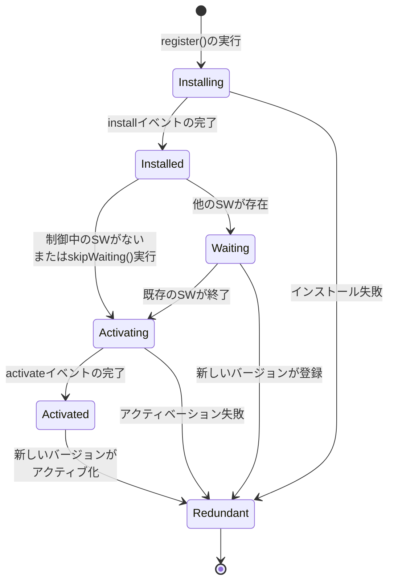
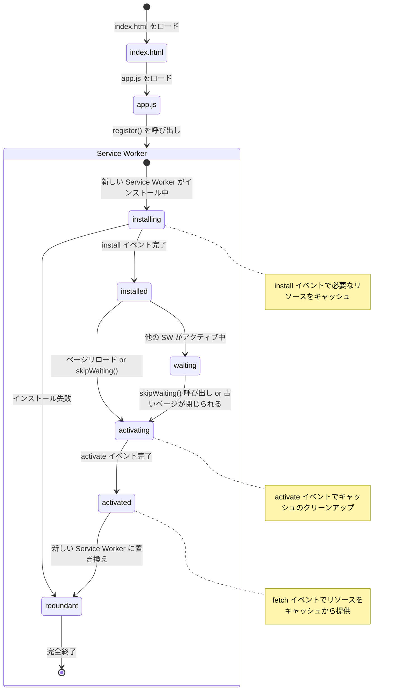

# Service Worker API
サービスワーカーはPWAの中核的な技術で、オフライン対応やキャッシュ管理、プッシュ通知などの機能を可能にします。サービスワーカーは、主にオフライン対応やバックグラウンド処理に特化した、ウェブワーカーです。

必ずしもPWAにサービスワーカーを実装する必要はありませんが、最低限のオフライン操作を提供するために、PWAと共にサービスワーカーを使用すると便利です。

サービスワーカーは、PWA を実装するために用いる特定の種類のウェブワーカーです。
すべてのウェブワーカーのように、サービスワーカーはメイン JavaScript コードとは別のスレッドで実行します。メインコードでワーカーを作成し、ワーカーのスクリプトに URL を渡します。ワーカーとメインコードは直接お互いの状態にアクセスすることはできませんが、メッセージを送り合うことで通信することができます。ワーカーは別のスレッドで実行されるため、アプリの UI を実装するアプリのメイン JavaScript コードはユーザーに対して応答し続けることができます。

サービスワーカーはワーカーのコンテキストで実行されます。従って、DOM へアクセスすることができず、アプリを実行する主要な JavaScript とは異なるスレッドで実行されるため、他のタスクをブロックすることはありません。完全に非同期で設計されています。そのため、同期型の XHR やウェブストレージのような API をサービスワーカーで使用することはできません。

- [Mdn Web Docks - サービスワーカー API](https://developer.mozilla.org/ja/docs/Web/API/Service_Worker_API)

## 特徴
- ワーカーのコンテキストで実行される。
- 他のタスクをブロックすることはできません。
- 完全に非同期で設計されています。
- DOM へアクセスすることができない
- 同期型の XHR やウェブストレージのような API を使用することはできない
- HTTPS 通信でのみ動作

Service Workerの特徴と制限について、より詳しく説明します

1. イベントベースの動作
   - オンデマンドに起動し、必要がなくなると終了します
   - 永続的なバックグラウンド処理ではありません
   - イベントが発生したときのみアクティブになります

2. プログラマブルなキャッシュ
   - Cache APIを使用して細かいキャッシュ制御が可能
   - ファイルやAPIレスポンスなど、様々なリソースをキャッシュできます
   - キャッシュの有効期限や更新戦略を柔軟に設定可能

3. HTTPS必須
   - セキュリティ上の理由からHTTPS環境でのみ動作
   - ローカル開発時のみlocalhostで動作可能

### 制限事項
もちろん、メインスレッドとは別のスレッドで動作するため、通常のブラウザで利用するJavaScriptとは異なり制限事項もあります。

1. JavaScript APIの制限
   - window オブジェクトにアクセス不可
   - DOMへの直接アクセス不可
   - synchronous XHR（同期的なXMLHttpRequest）は使用不可
   - localStorage へのアクセス不可

2. スコープの制限
   - Service Workerのファイルが置かれたディレクトリ以下のみが制御対象
   - 上位ディレクトリは制御できない
   - 異なるオリジンのリソースは制御できない

3. 実行環境の制限
   - メインスレッドとは別のスレッドで動作するため、UIをブロックしない
   - WebWorkerと同様に、UIスレッドと直接データをやり取りできない
   - postMessageを使用して通信する必要がある

4. ライフサイクルの制限
   - Service Workerの更新は即時反映されない
   - 古いService Workerが制御しているページがすべて閉じられるまで、新しいバージョンは待機状態
   - 強制的な更新には、skipWaitingとclients.claimの使用が必要

### 注意点
1. デバッグ
   - Chrome DevToolsのApplication > Service Workersタブで状態確認可能
   - エラーはConsoleに表示される
   - キャッシュの内容も確認可能

2. 開発時の注意
   - Service Workerのスコープを適切に設定することが重要
   - キャッシュ戦略は慎重に選択する必要がある
   - バージョン管理とアップデート戦略を事前に計画すべき
## Service Worker基本構造

サービスワーカーには、各イベントに対してどのような処理を行うのか？を定義する。

### serviceWorker.js

```js
// serviceWorker.js（Service Workerファイル）の基本構造
self.addEventListener('install', event => {
  // キャッシュの準備など
    console.log('Service worker self listener: installing');
});

self.addEventListener('activate', event => {
  // 古いキャッシュの削除など
    console.log('Service worker self listener: activate');
});

self.addEventListener('fetch', event => {
  // ネットワークリクエストの制御
    console.log('Service worker self listener: fetch');
});

self.addEventListener("push", (event) => {
  // プッシュ通知を受け取った時の制御
    console.log('Service worker self listener: push');
});
```
## Service Workerの利用方法

Service Workerは3つの主要なステップ（ダウンロード、インストール、有効化）を経て利用可能になります。

### 1. ダウンロード段階

#### ダウンロードのタイミング
- **初回アクセス時**: ユーザーが制御対象のサイトやページに最初にアクセスした時
- **更新時**:
  - スコープ内のページへの移動が発生した時
  - イベントが発生し、24時間以内にダウンロードが行われていない場合

#### ダウンロードの処理
1. `ServiceWorkerContainer.register()` メソッドによる登録
2. Service Workerファイルのダウンロード
3. ファイルの変更検出（既存のService Workerとバイト単位での比較）

### 2. インストール段階

#### インストールが開始される条件
- 新しいService Workerファイルが検出された場合
- サイトで初めてService Workerが見つかった場合
- 既存のService Workerとファイルの内容が異なる場合

#### インストール中の処理
- `install` イベントの発火
- キャッシュの初期設定
- 必要なリソースの事前キャッシュ

### 3. 有効化段階

#### 有効化の条件
- インストールが成功した場合
- 既存のService Workerがない場合は直ちに有効化
- 既存のService Workerがある場合は、全てのクライアントが閉じられるまで待機

#### 有効化中の処理
- `activate` イベントの発火
- 古いキャッシュの削除
- データベースのマイグレーション
- 新しい処理の開始準備

### 実装例

```html
<!DOCTYPE html>
<html lang="en">
<head>
  <meta charset="UTF-8">
  <meta name="viewport" content="width=device-width, initial-scale=1.0">
  <title>Service Worker Registration Example</title>
</head>
<body>  
  <script>
    if ("serviceWorker" in navigator) {
      navigator.serviceWorker
        .register("service-worker.js", {
          scope: "./",
        })
        .then((registration) => {
          // Service Workerの状態を確認
          let serviceWorker;
          
          // 1. インストール中の確認
          if (registration.installing) {
            serviceWorker = registration.installing;
            console.log('Service worker: installing');
          } 
          // 2. インストール済み・待機中の確認
          else if (registration.waiting) {
            serviceWorker = registration.waiting;
            console.log('Service worker: waiting');
          } 
          // 3. 有効化済みの確認
          else if (registration.active) {
            serviceWorker = registration.active;
            console.log('Service worker: active');
          }

          // 状態変更の監視
          if (serviceWorker) {
            console.log(`Service worker state: ${serviceWorker.state}`);
            serviceWorker.addEventListener("statechange", (e) => {
              console.log(`Service worker state changed to: ${e.target.state}`);
            });
          }
        })
        .catch((error) => {
          console.log(`Service worker registration failed: ${error}`);
        });
    } else {
      console.log(`This browser does not support service workers`);
    }
  </script>
</body>
</html>
```

### 注意点

#### 1. **HTTPSの要件**
- Service Workerの使用にはHTTPS環境が必要
- ローカル開発時は `localhost` でも動作

#### 2. **スコープの設定**
- `register()` のオプションで制御範囲を指定可能
- デフォルトはService Workerファイルの配置ディレクトリ

#### 3. **更新の確認**
- 24時間ごとに自動的に更新確認
- 手動での更新確認も可能

#### 4. **デバッグ方法**
- Chrome DevToolsの Application タブで状態確認可能
- コンソールログで各段階の状態を確認可能


## Service Workerの責任
Service Workerの主な責任について説明します。

以下の責任を適切に実装することで、オフライン対応やパフォーマンス向上など、PWAの重要な機能を実現することができます。

### 1. ネットワークリクエストの制御
- ページからのリクエストをインターセプト
- リクエストの処理方法をプログラムで制御
- オフライン時のフォールバック対応

```js
self.addEventListener('fetch', event => {
  event.respondWith(
    caches.match(event.request)
      .then(response => response || fetch(event.request))
  );
});
```

### 2. リソースのキャッシュ管理
- 静的アセット（HTML、CSS、JS、画像など）のキャッシュ
- APIレスポンスのキャッシュ
- キャッシュの更新と古いキャッシュの削除

```js
self.addEventListener('install', event => {
  event.waitUntil(
    caches.open('my-cache-v1').then(cache => {
      return cache.addAll([
        '/',
        '/styles/main.css',
        '/scripts/app.js'
      ]);
    })
  );
});
```

### 3. プッシュ通知の処理
- プッシュサーバーからの通知を受信
- 通知の表示制御
- ユーザーの通知クリックへの対応

```js
self.addEventListener('push', event => {
  const options = {
    body: event.data.text(),
    icon: 'images/icon.png',
    badge: 'images/badge.png'
  };
  event.waitUntil(
    self.registration.showNotification('Title', options)
  );
});
```

### 4. バックグラウンド同期
- オフライン時のデータ保存
- ネットワーク復帰時の同期処理

```js
self.addEventListener('sync', event => {
  if (event.tag === 'outbox') {
    event.waitUntil(
      // 保存されたデータの送信処理
    );
  }
});
```

### 5. アプリケーションのライフサイクル管理
アプリケーションのライフサイクル管理について、主な段階とそれぞれの役割を具体的に説明します：

#### 5.1. 登録（Registration）
```javascript
// メインのJavaScriptファイルでの登録
if ('serviceWorker' in navigator) {
  navigator.serviceWorker.register('/sw.js', {
    scope: '/' // Service Workerの制御範囲を指定
  }).then(registration => {
    console.log('Service Worker registered with scope:', registration.scope);
  });
}
```

#### 5.2. インストール（Installation）
```javascript
self.addEventListener('install', event => {
  event.waitUntil(
    // 初期キャッシュの設定
    caches.open('v1').then(cache => {
      return cache.addAll([
        '/',
        '/styles/main.css',
        '/scripts/app.js'
      ]);
    })
  );
  
  // 任意: 古いService Workerを待たずに即座にアクティブ化
  // self.skipWaiting();
});
```

#### 5.3. アクティベーション（Activation）
```javascript
self.addEventListener('activate', event => {
  event.waitUntil(
    Promise.all([
      // 古いキャッシュの削除
      caches.keys().then(cacheNames => {
        return Promise.all(
          cacheNames
            .filter(cacheName => cacheName !== 'v1')
            .map(cacheName => caches.delete(cacheName))
        );
      }),
      
      // 任意: 現在のService Workerですべてのクライアントを制御
      // clients.claim()
    ])
  );
});
```

#### 5.4. 更新プロセス
```javascript
// バージョン管理
const CACHE_VERSION = 'v1';

// 更新確認
self.addEventListener('activate', event => {
  event.waitUntil(
    caches.open(CACHE_VERSION).then(cache => {
      // 新しいバージョンのキャッシュを作成
      return cache.keys().then(requests => {
        return Promise.all(
          requests.map(request => {
            // 必要に応じてキャッシュを更新
            return fetch(request).then(response => {
              return cache.put(request, response);
            });
          })
        );
      });
    })
  );
});

// クライアントへの更新通知
self.addEventListener('message', event => {
  if (event.data.action === 'skipWaiting') {
    self.skipWaiting();
  }
});
```

#### 5.5. エラーハンドリング
```js
self.addEventListener('error', event => {
  console.error('Service Worker error:', event.error);
});

self.addEventListener('unhandledrejection', event => {
  console.error('Unhandled promise rejection:', event.reason);
});
```

#### 5.6. 重要な考慮点

##### 更新の検出と管理
- ブラウザは24時間ごと、もしくはService Workerファイルが変更された時に更新をチェック
- 更新があった場合、新しいService Workerは待機状態になる
- 既存のページがすべて閉じられるまで、古いService Workerがアクティブのまま

#### 強制更新のテクニック
```js
// メインアプリケーションでの更新チェック
function checkForUpdates() {
  navigator.serviceWorker.ready.then(registration => {
    registration.update();
  });
}

// 定期的な更新チェック
setInterval(checkForUpdates, 60 * 60 * 1000); // 1時間ごと
```

#### デバッグとモニタリング
```js
navigator.serviceWorker.register('/sw.js').then(registration => {
  registration.addEventListener('statechange', () => {
    console.log('Service Worker state:', registration.active.state);
  });
});
```

## Service Workerのライフサイクル



|状態|説明|
|---|---|
|Installing|installイベント発生<br>初期キャッシュの設定など初期化処理を実行|
|Installed|インストール完了<br>アクティベーション待ち|
|Waiting|既存のService Workerの終了を待機中|
|Activating|activateイベント発生<br>古いキャッシュの削除など更新処理を実行|
|Activated|fetchイベントや、その他のイベントを処理可能な状態|
|Redundant|使用されなくなった状態<br>新しいSWにより置き換えられた、またはインストール/アクティベーション失敗|


## Servic Worker　の登録から、終了までのライフサイクル

以下は、Service Worker の状態遷移とライフサイクル、ユーザーアクションやイベント処理を表現したものです。



### Service Worker の状態（state の種類）
|状態名|説明|
|---|---|
|installing|Service Worker が インストール中。install イベントが発生し、初期セットアップが実行されている状態|
|installed|Service Worker のインストールが 成功した状態。ただし、まだページを制御していない（waiting 状態のことも）|
|activating|Service Worker が 有効化中。activate イベントが発生し、古いキャッシュの削除や新しい準備が行われている状態|
|activated|Service Worker が 有効化され、ページを制御している状態。fetch イベントや他のイベントが処理可能|
|redundant|Service Worker が不要になり、破棄された状態（例: 新しいバージョンの Service Worker がアクティブになった場合）|

### 詳細説明

1. Service Worker の登録
   - ユーザーがブラウザで index.html を開く
   - app.js がロードされ、navigator.serviceWorker.register() が呼び出されます。
   - この時点で新しい Service Worker がインストールを開始し、状態は installing に遷移します。
2. 状態遷移の詳細
   1. installing
      - Service Worker がインストール中の状態
      - install イベントが発生
      - リソースのキャッシュ保存や初期セットアップを行う。
      - 終了条件:  
      インストールが成功すると installed 状態に遷移
   2. installed
      - インストールが完了したが、まだページを制御していない状態。
      - この状態では、次の 2 パターンが考えられます：
         1. waiting 状態:  
         他のアクティブな Service Worker が存在する場合、新しい Service Worker は待機。
         2. activating 状態:  
         ページがリロードされるか、skipWaiting() が呼び出される。
   3. waiting
      - 既存の Service Worker がユーザーのページを制御中で、新しい Service Worker は待機している。
      - トリガー条件:
        - ページをすべて閉じる。
        - skipWaiting() を呼び出す。
   4. activating
      - Service Worker が有効化中
      - activate イベントが発生し、以下を実行：
         - 古いキャッシュデータの削除
         - 新しいリソースの準備
         - 有効化が完了すると activated 状態に遷移
   5. activated
      - Service Worker が完全に有効化され、リソースを制御中
      - 発生するイベント:  
         - fetch イベント:  
         キャッシュ済みリソースを返すか、ネットワークリクエストを処理。
         - その他:  
         メッセージ受信や通知表示。
   6. redundant
      - Service Worker が不要になり、破棄された状態
      - 発生条件:
         - 新しい Service Worker に置き換えられる。
         - unregister() が呼び出される。


## Service Workerの生存期間（ライフサイクル）と動作について
Service Workerの生存期間（ライフサイクル）と動作について

### 1. アイドル状態と終了
- Service Workerは、イベントを処理していない時はアイドル状態になります
- アイドル状態が続くと、ブラウザによって終了される可能性があります
- これはメモリとリソースの効率的な使用のための仕組みです

```js
// 例：fetch イベントの処理
self.addEventListener('fetch', (event) => {
  // このイベントハンドラは、リクエストがあった時だけ実行される
  // リクエストの処理が終わると、Service Workerは再びアイドル状態に
});
```

### 2. イベント駆動の再起動
- 登録済みのService Workerは、関連するイベントが発生すると自動的に起動します
- ブラウザが起動していれば、必要な時に自動的に再起動します
```js
self.addEventListener('fetch', (event) => {
  // ブラウザが起動していれば、
  // プッシュ通知が来た時に自動的にService Workerが起動して
  // このハンドラが実行される
});
```

### 3. waitUntil()の重要性
- イベント処理の完了を保証するための仕組み
- 処理が完了する前にService Workerが終了するのを防ぎます
```js
// インストール時のイベントリスナー
self.addEventListener('install', (event) => {
  event.waitUntil(
    // この非同期処理が完了するまでService Workerは終了されない
    caches.open(CACHE_NAME).then(cache => {
      return cache.addAll(['/index.html', '/styles.css']);
    })
  );
});
```

### 4. 実際の動作例

```typescript
// 1. プッシュ通知受信時のイベントリスナー
self.addEventListener('push', (event) => {
  console.log('Service Worker起動: プッシュ通知受信');
  event.waitUntil(
    (async () => {
      // 通知を表示
      await sw.registration.showNotification('新着メッセージ');
      console.log('通知表示完了');
      // この処理が終わるとService Workerは再びアイドル状態に
    })()
  );
});

// 2. ネットワークリクエスト時のイベントリスナー
self.addEventListener('fetch', (event) => {
  console.log('Service Worker起動: プッシュ通知受信');
  event.respondWith(
    (async () => {
      const cache = await caches.open(CACHE_NAME);
      const response = await cache.match(event.request);
      console.log('リクエスト処理完了');
      // この処理が終わるとService Workerは再びアイドル状態に
      return response || fetch(event.request);
    })()
  );
});
```

### 重要な点として
1. Service Workerは常に実行されているわけではありません
2. 必要なイベントが発生した時に起動します
3. 処理が完了すると、再びアイドル状態に戻ります
4. アイドル状態が続くとブラウザにより終了される可能性があります

## Web Workerとの違い
Service WorkerはWeb Workerの一部ではあるが、基本的に以下の点で使われ方や方法が異なります。

- Service Workerは、主にオフライン対応やバックグラウンド処理に特化
- Web Workerは、CPU負荷の高い処理をメインスレッドから切り離すために使用

### 比較詳細
|比較項目|Service Worker|Web Worker|
|---|---|---|
|目的と用途|<ul><li>PWAの機能を実現するためのプロキシサーバーとして動作</li><li>オフラインサポート、プッシュ通知、バックグラウンド同期など</li></ul>|<ul><li>CPUを使う重い処理をメインスレッドから分離して実行</li><li>複雑な計算、データ処理、画像処理など</li></ul>|
|ライフサイクル|<ul><li>イベントベースで動作し、必要なときだけ起動</li><li>ブラウザを閉じても登録は維持される</li></ul>|<ul><li>ページが生きている間、常に動作し続ける</li><li>ページを閉じると終了する</li></ul>|
|スコープ|<ul><li>ドメイン全体またはサブディレクトリに対して動作</li><li>1つのスコープに1つのService Workerのみ登録可能</li></ul>|<ul><li>特定のページに紐づく</li><li>1つのページに複数のWorkerを作成可能</li></ul>|
|ネットワーク操作|<ul><li>ネットワークリクエストをインターセプト可能（fetchイベント）</li><li>キャッシュAPIを使用して、ネットワークリクエストのレスポンスを管理可能</li></ul>|<ul><li>ネットワークリクエストを直接インターセプトする機能はない</li><li>fetchなどのAPIを使用してネットワーク操作は可能だが、プロキシとしては動作しない</li></ul>|
|スレッドとの関係|<ul><li>イベント駆動型であり、ブラウザのバックグラウンドスレッド上で動作</li><li>ページごとに独立したスレッドではなく、複数のページ間で共有可能</li></ul>|<ul><li>ページごとに専用のスレッドを作成</li><li>複数ページ間で共有されることはない（Shared Workerは例外）</li></ul>|
|利用可能なAPIや機能|<ul><li>特殊なイベントリスナーを利用（例: install, activate, fetch, push）</li><li>Cache API</li><li>Fetch API</li><li>Background Sync API</li><li>Push API</li><li>Notification API</li></ul>|<ul><li>DOMにはアクセスできないが、計算タスクに必要な標準ライブラリは使用可能</li><li>WebSockets</li><li>Fetch API</li><li>IndexedDB</li><li>Crypto API</li></ul>|
|ユースケース|<ul><li>オフライン対応（キャッシュ管理でレスポンスを提供）</li><li>プッシュ通知（ユーザーとのリアルタイムコミュニケーション）</li><li>バックグラウンド同期（低帯域のネットワーク環境でのデータ送信）</li></ul>|<ul><li>計算負荷の高い処理（画像処理、大規模データ解析、暗号化計算など）</li><li>データ処理中でもUIのスムーズな操作を維持</li></ul>|